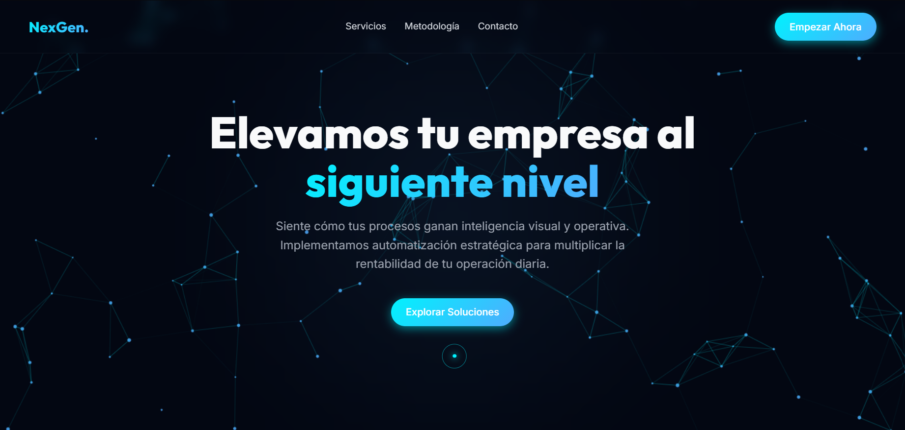
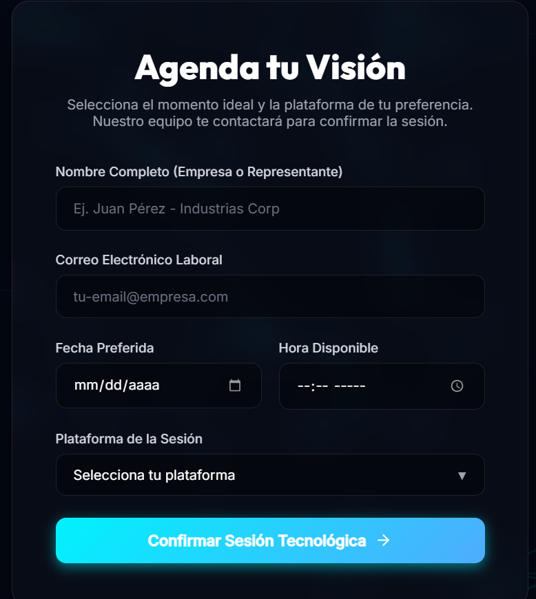
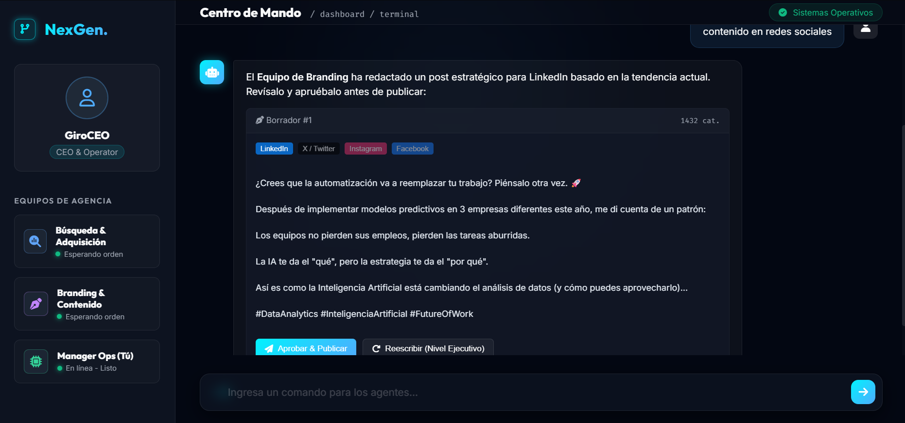

# 🚀 NexGen — AI-Powered Business Automation Concept

This project is a conceptual prototype of a business automation platform built with the support of AI-assisted development and prompt engineering.

---

## 🚀 Overview

**NexGen** is designed as a centralized system for companies looking to:

* Optimize operations
* Automate workflows
* Enhance decision-making through intelligent tools

This prototype demonstrates how AI (Google Antigravity) can accelerate the creation of functional systems starting from a simple idea.
* 

---

## 💡 Key Features

### 🌐 Landing Page

* Modern UI/UX design
* Conversion-focused structure
* Clear value proposition for automation services
* 

---

### 📅 Smart Booking System

* Client data capture form
* Scheduling interface for consultations
* Seamless user experience
* 

---

### 🧑‍💻 Admin Dashboard ("Command Center") & AI Content Assistant

* Centralized operational view
* Interactive interface
* Chat-based interaction
* Generates social media posts
* Platform selection (LinkedIn, Instagram, etc.)
* Ready for automated publishing workflows,
* 

---

## 🧠 Role of AI

This project was developed using AI tools (**Google Antigravity**) combined with structured prompt engineering.

The goal was not to replace development, but to:

* Accelerate ideation
* Generate UI/UX concepts quickly
* Prototype functional workflows
* Reduce time from idea to execution

---

## 🚀 Why This Matters

This project highlights a shift in how digital products can be built:

* AI reduces development time significantly
* Ideas can be validated faster
* Prototypes can be created without starting from scratch
* Enables faster iteration and experimentation

---

## 🔑 Takeaway

The real advantage is not just using AI, it's knowing how to communicate effectively with it.

👉 Prompt engineering becomes a critical skill to bridge ideas and execution!

---

## 📈 Future Potential

This concept can evolve into:

* Full SaaS automation platform
* Integrated CRM + operations system
* AI-driven marketing engine
* End-to-end business operating system

---

## 🧩 Use Cases

This type of system can be applied to:

* Service-based businesses
* Agencies
* E-commerce operations
* Internal business tools

---

## ⚠️ Disclaimer

This is a conceptual prototype, not a production-ready system.

Its purpose is to demonstrate:

* Capabilities
* Possibilities
* Speed of execution using AI

---

## 🤝 Contributing

Open to ideas, improvements, and collaborations.

---

## 📬 Contact

If you're interested in building something similar or exploring automation systems, feel free to connect.
